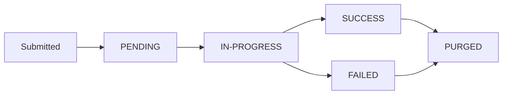

## Status flow

## Status reference

| Status | Meaning | What you should do |
|--------|---------|-------------------|
| `PENDING` | Job accepted, not yet started | Poll again in 30–60 seconds |
| `IN-PROGRESS` | Processing is active | Poll again in 30–60 seconds |
| `SUCCESS` | Completed successfully | Read `result` from the status response and store it |
| `FAILED` | Completed with an error | Read `error_msg`, fix the input, and resubmit as a new job |
| `PURGED` | Job data has expired | Results are gone — re-run the job if needed |

`SUCCESS`, `FAILED`, and `PURGED` are **terminal states**. Stop polling once you reach one of these.

## Practical guidance

<Steps>
  <Step title="Submit the async job" icon="upload" titleType="p">
    Call [Mask Async](/async-apis/mask-async) or [Unmask Async](/async-apis/unmask-async). Store the `tracking_id` from the response.
  </Step>

  <Step title="Poll until terminal" icon="refresh-cw" titleType="p">
    Call [Async Status](/async-apis/async-status) every 30–60 seconds. Continue until status is `SUCCESS`, `FAILED`, or `PURGED`.
  </Step>

  <Step title="Handle the terminal state" icon="check-square" titleType="p">
    - **SUCCESS**: Read `result` and store the output in your system immediately
    - **FAILED**: Read `error_msg`, fix the input payload, and submit a new job
    - **PURGED**: Results are no longer available — re-submit the job if results are still needed
  </Step>
</Steps>

<Callout kind="alert">
  Store results on your side when the job reaches `SUCCESS`. Job data will eventually be purged and cannot be recovered after that point.
</Callout>

## Polling interval recommendation

Poll every **30 to 60 seconds**. More frequent polling is unnecessary for batch workloads and increases API load without benefit.
