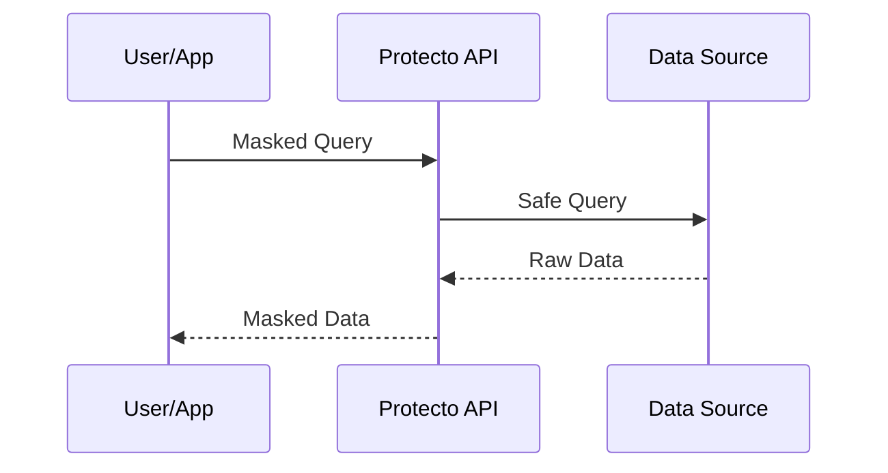

## Overview

Protecto integrates seamlessly with your data infrastructure to discover, classify, and protect sensitive data. You can connect databases like Snowflake and BigQuery, object storage such as S3, and Redshift warehouses. For dynamic workflows, configure webhooks and handle data pipelines or GenAI applications.

<Callout kind="info">
Before starting, ensure you have:
- A valid Protecto API key from the dashboard
- Appropriate IAM roles or service account credentials for your data sources
- Network access to `https://api.protecto.ai`
</Callout>

## Supported Integrations

<Columns cols={3}>
  <Card title="Databases" icon="database" href="#databases">
    Connect Snowflake, BigQuery, and Redshift for structured data scanning and masking.
  </Card>
  <Card title="Object Storage" icon="cloud" href="#object-storage">
    Integrate S3 buckets for unstructured data protection.
  </Card>
  <Card title="Advanced Workflows" icon="zap" href="#workflows">
    Set up webhooks, pipelines, and GenAI protections.
  </Card>
</Columns>

## Database Connections

Use the Protecto API to establish secure connections. Each integration requires authentication details and scan configurations.

<Tabs>
  <Tab title="Snowflake" icon="database">
    <Steps>
      <Step title="Create Connection" icon="settings">
        Generate a service token in Snowflake and note your account URL, warehouse, database, and schema.
      </Step>
      <Step title="API Call" icon="code">
        Use this endpoint to register the connection.
        
        <CodeGroup tabs="cURL,JavaScript">
        ```
        curl -X POST https://api.protecto.ai/v1/connections \
          -H "Authorization: Bearer YOUR_API_KEY" \
          -H "Content-Type: application/json" \
          -d '{
            "type": "snowflake",
            "config": {
              "account": "your-account.snowflakecomputing.com",
              "user": "protecto_user",
              "warehouse": "compute_wh",
              "database": "prod_db",
              "schema": "public"
            }
          }'
        ```
        ```javascript
        const response = await fetch('https://api.protecto.ai/v1/connections', {
          method: 'POST',
          headers: {
            'Authorization': 'Bearer YOUR_API_KEY',
            'Content-Type': 'application/json'
          },
          body: JSON.stringify({
            type: 'snowflake',
            config: {
              account: 'your-account.snowflakecomputing.com',
              user: 'protecto_user',
              warehouse: 'compute_wh',
              database: 'prod_db',
              schema: 'public'
            }
          })
        });
        ```
        </CodeGroup>
      </Step>
      <Step title="Verify" icon="check-circle">
        Run a test scan: `POST /v1/scans` with `connection_id` from response.
      </Step>
    </Steps>
  </Tab>
  <Tab title="BigQuery" icon="database">
    <Steps>
      <Step title="Service Account" icon="key">
        Create a Google Cloud service account with BigQuery Data Editor role. Download the JSON key.
      </Step>
      <Step title="Connect" icon="link">
````javascript
const response = await fetch('https://api.protecto.ai/v1/connections', {
  method: 'POST',
  headers: {
    'Authorization': 'Bearer YOUR_API_KEY',
    'Content-Type': 'application/json'
  },
  body: JSON.stringify({
    type: 'bigquery',
    config: {
      project_id: 'your-project-123',
      dataset_ids: ['sales_data', 'user_logs'],
      service_account_json: '{ "type": "service_account", ... }'
    }
  })
});
````
      </Step>
    </Steps>
  </Tab>
  <Tab title="Redshift" icon="database">
    Use JDBC connection string and IAM role for secure access.
    
    <ParamField path="connection_string" param-type="string" required="true">
      Full JDBC URL: `jdbc:redshift://your-cluster.us-west-2.redshift.amazonaws.com:5439/prod`
    </ParamField>
    
    <ParamField header="X-Aws-Role-Arn" param-type="string">
      ARN of the IAM role for Protecto.
    </ParamField>
  </Tab>
</Tabs>

## Object Storage

<Expandable title="S3 Integration Details" default-open="true">
Protecto scans S3 buckets for sensitive files like CSVs or JSON logs.

```javascript
// Example bucket scan
await fetch('https://api.protecto.ai/v1/scans', {
  method: 'POST',
  headers: { 'Authorization': 'Bearer YOUR_API_KEY' },
  body: JSON.stringify({
    type: 's3',
    bucket: 'your-sensitive-data-bucket',
    prefix: 'logs/2024/'
  })
});
```

Grant Protecto read access via bucket policy.
</Expandable>

## Advanced Workflows

### Webhooks
Configure webhooks for real-time events like scan completions.

<ParamField path="webhook_url" param-type="string" required="true">
  Your endpoint: `https://your-webhook-url.com/protecto-events`
</ParamField>

### Data Pipelines and GenAI
For pipelines (e.g., Airflow), use Protecto SDK to mask data inline. In GenAI workflows, proxy inputs/outputs through Protecto APIs.



<Callout kind="tip">
Test integrations in staging first. Monitor connection health via dashboard at `https://dashboard.protecto.ai/connections`.
</Callout>