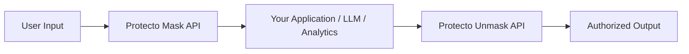

## Common problems without Protecto

Most teams run into the same issues when handling sensitive data:

| Problem | What typically goes wrong |
|---------|--------------------------|
| Manual masking | Hard-coded regexes break and miss edge cases |
| Inconsistent tokens | Same value masked differently across systems |
| GenAI leakage | Prompts and responses accidentally expose PII |
| Compliance pressure | No clear audit trail or retention controls |
| Performance | Heavy privacy tooling slows down core services |

## What Protecto does differently

Protecto provides **centralized, deterministic tokenization** with APIs fast enough for real-time use and flexible enough for batch processing.

- **Auto-detect unknown PII** in free-form text — no pre-labeling required
- **Consistent tokens** — the same value always produces the same token when using the same token type, enabling joins, analytics, and comparisons
- **Controlled unmasking** — you decide who can unmask, and under which policy
- **Async APIs** — handle large payloads without timeouts
- **Built-in toxicity scoring** — protect GenAI workflows from harmful content

## Where Protecto fits

Protecto is designed to sit at **data boundaries** — wherever sensitive data enters or leaves your system:

You call the Mask API on input, work with tokens internally, and call the Unmask API only when the original value is genuinely needed by an authorized workflow.
